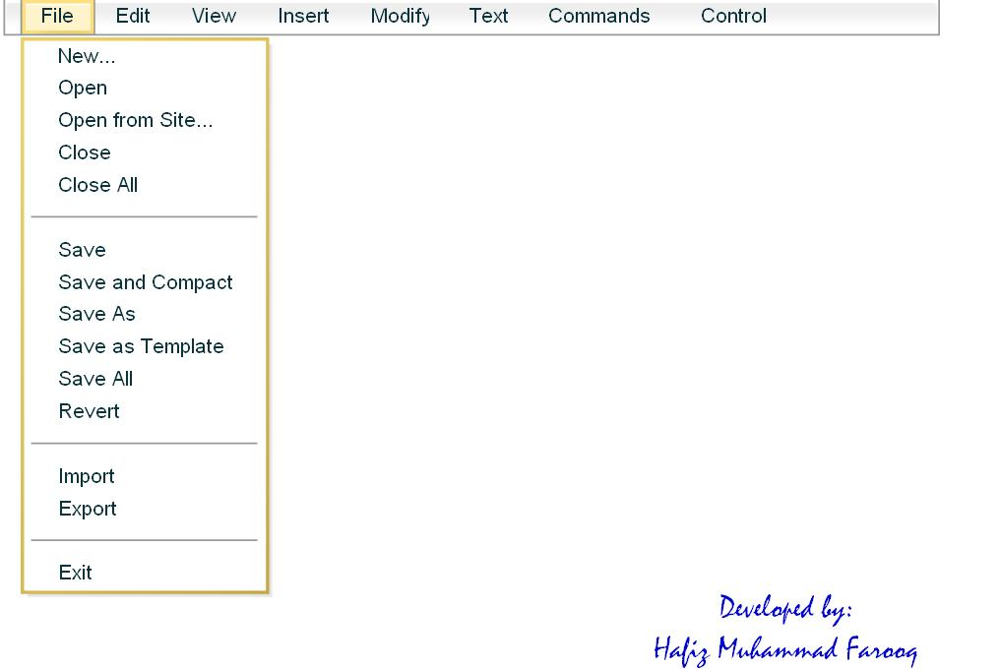



## Flash And VB Menu Bar

### Description

It is very pleasure for me to upload this kind of project. This is a menu bar project which is created in Flash 8 and working in VB 6.0 with the help of FSCOMMAND. You can change the Menu Items by editing "MENUBAR.XML" file.

SPECIAL THANKS to Mr Muhammad Akhtar to who helped me to understand and work with FLASH and VB.

In case of any Query, feel free to contact me

Name: Hafiz Muhammad Farooq

Email: hafizm.farooq@hotmail.com
 
### More Info
 

             |
---                |---
**Submitted On**   |2009-05-17 11:56:46
**By**             |[M\.Farooq](https://github.com/Planet-Source-Code/PSCIndex/blob/master/ByAuthor/m-farooq.md)
**Level**          |Beginner
**User Rating**    |3.6 (18 globes from 5 users)
**Compatibility**  |VB 6\.0
**Category**       |[Custom Controls/ Forms/  Menus](https://github.com/Planet-Source-Code/PSCIndex/blob/master/ByCategory/custom-controls-forms-menus__1-4.md)
**World**          |[Visual Basic](https://github.com/Planet-Source-Code/PSCIndex/blob/master/ByWorld/visual-basic.md)
**Archive File**   |[Flash\_And\_2153035242009\.zip](https://github.com/Planet-Source-Code/m-farooq-flash-and-vb-menu-bar__1-72106/archive/master.zip)

